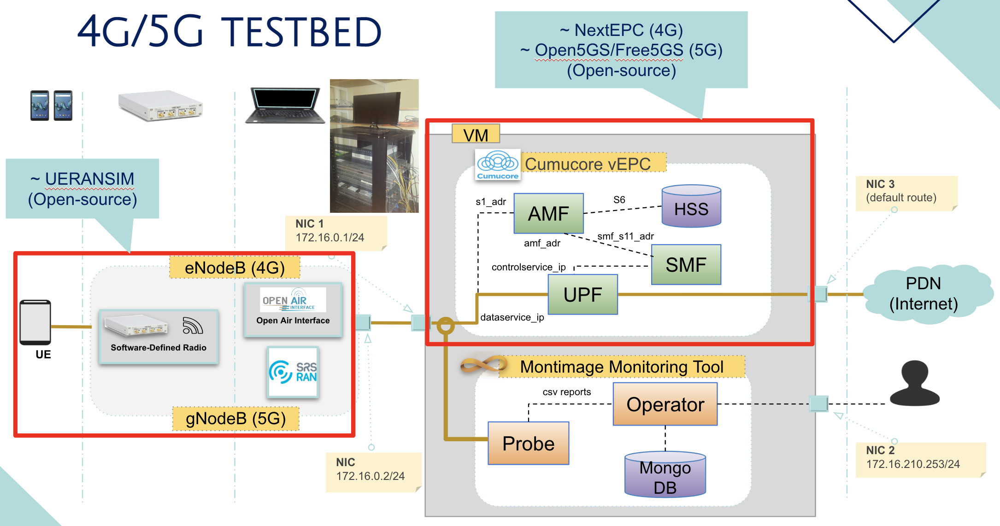
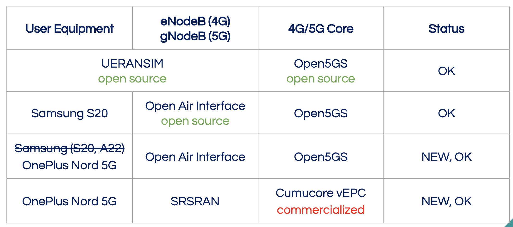

Deploying a 5G testbed requires several components to be put in place. The main components include:

- **5G Core Network**: This is the central component of a 5G testbed, and it provides the necessary network functions and services to enable communication between devices. It includes the Access and Mobility Management Function (AMF), Session Management Function (SMF), User Plane Function (UPF), Network Slice Selection Function (NSSF), Authentication Server Function (AUSF), and Policy Control Function (PCF).
- **5G Radio Access Network**: This is the part of the 5G network that provides the wireless connectivity between devices and the core network. It consists of:
    - **5G Base Station (gNB)**
    - **5G User Equipment (UE)**
- Other components:
    - **Network Slicing**: This component allows the network to be partitioned into different virtual networks or slices, each with its own specific set of requirements and characteristics.
    - **Virtualization Infrastructure**: This component provides the necessary computing and storage resources to support the deployment of the 5G core network and RAN components. It includes virtual machines, container-based systems, and cloud computing platforms.
    - **Testing Tools and Software**: These are the tools and software used to test the 5G network and to evaluate its performance, including network simulators, performance testing tools, and network monitoring and analysis software.
    - **Management and Orchestration**: This component provides the necessary tools and software to manage and orchestrate the various components of the 5G testbed, including the core network, RAN, network slicing, and virtualization infrastructure.

Some combination of existing solutions, either open-source or commercial, for deploying a 5G testbed are shown in the following table.

