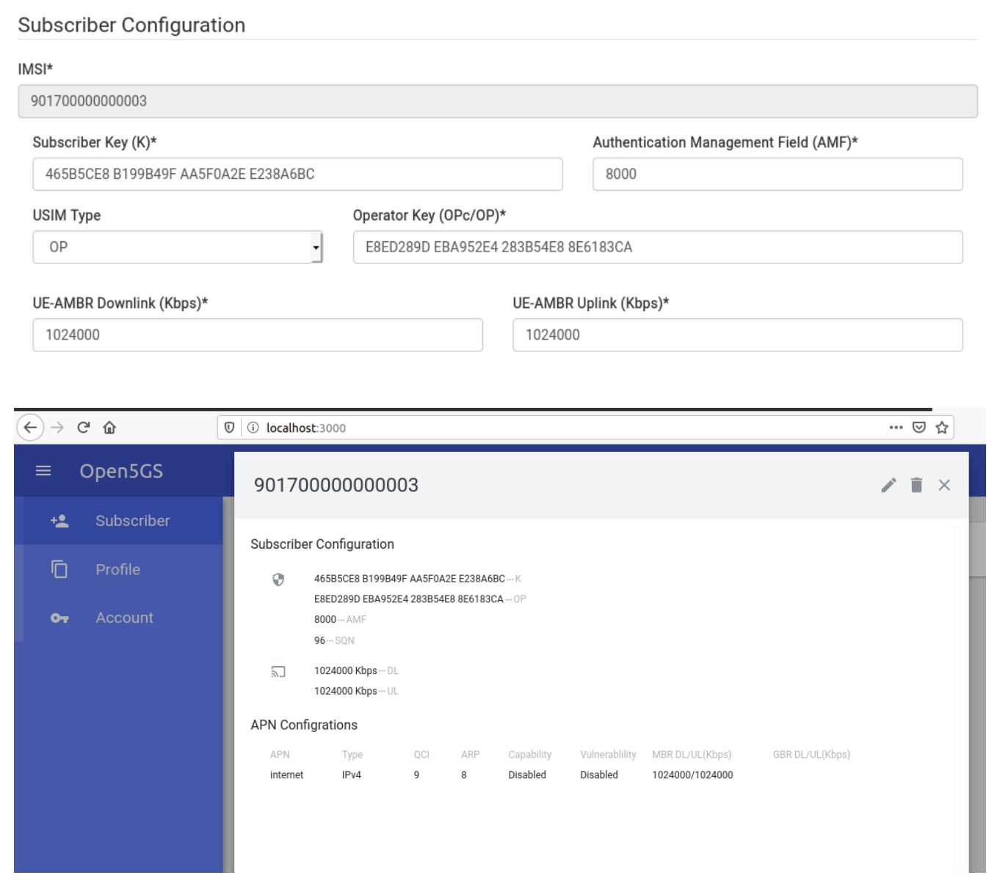

## Build tools and dependencies

- Create a VM running Ubuntu 20.04 on Virtual Box
```shell
sudo apt install python3-pip python3-setuptools python3-wheel ninja-build build-essential
sudo apt install flex bison git libsctp-dev libgnutls28-dev libgcrypt-dev libssl-dev libidn11-dev
sudo apt install libmongoc-dev libbson-dev libyaml-dev libnghttp2-dev libmicrohttpd-dev
sudo apt install libcurl4-gnutls-dev libnghttp2-dev meson
sudo apt install software-properties-common
sudo add-apt-repository ppa:open5gs/latest
sudo apt update
sudo apt install open5gs
```
- Install WebUI for open5gs (should install it from source) https://open5gs.org/open5gs/docs/guide/02-building-open5gs-from-sources/
```shell
# Install nodejs 
sudo apt install curl
curl -sL https://deb.nodesource.com/setup_12.x | sudo -E bash -
sudo apt install nodejs

# Build WebUI
git clone https://github.com/open5gs/open5gs
cd webui
npm install
sudo systemctl stop open5gs-webui
npm run dev
```

## Create a new subscriber

- For instance, create a new subscriber on [http://localhost:3000](http://localhost:3000/) (`admin : 1423`) using information in `UERANSIM/config/open5gs-ue.yaml` for UERANSIM
    - IMSI: 901700000000003
    - Subscriber Key: 465B5CE8B199B49FAA5F0A2EE238A6BC
    - Operator Key: E8ED289DEBA952E4283B54E88E6183CA
    - AMF: 8000
    - USIM Type: OP (pay attention)



## Modify config files

- Pay attention: in config file `open5gs-gnb.yaml`, should use IP of the VM
- You can view the log at `/var/log/open5gs/*.log`
```shell
# Show logs to debug & fix errors in case the phone failed to connect to SRS RAN
journalctl -f -t open5gs-amfd
exit

tail -f /var/log/open5gs/mme.log
```

- We often need to modify some config files, like afm.yaml and upf.yaml. Then, we need to restart 5G core services
```shell
sudo vi /etc/open5gs/afm.yaml
sudo vi /etc/open5gs/upf.yaml
sudo systemctl restart open5gs-amfd.service
sudo systemctl restart open5gs-upfd.service

sudo service open5gs-webui restart
```
